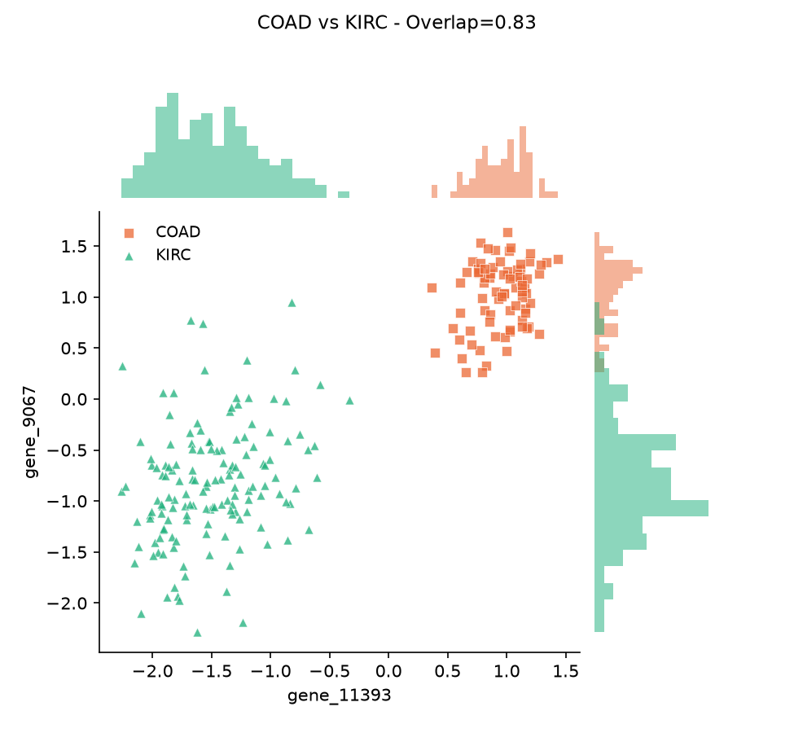
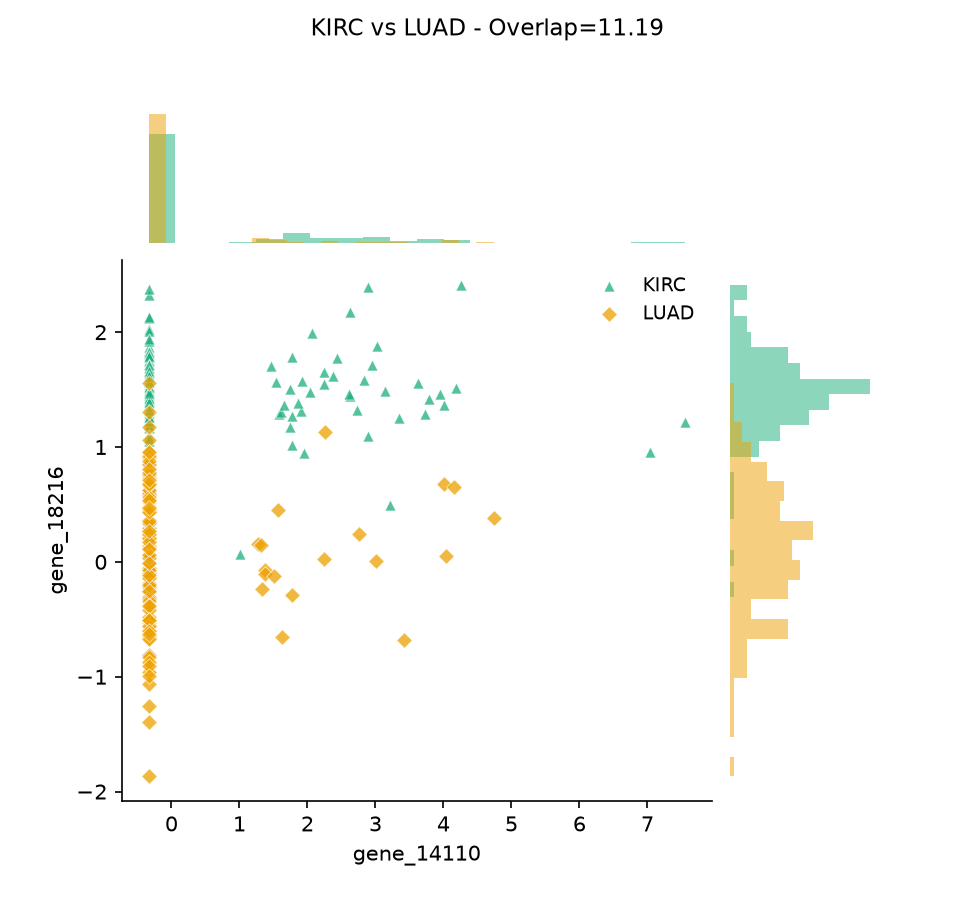
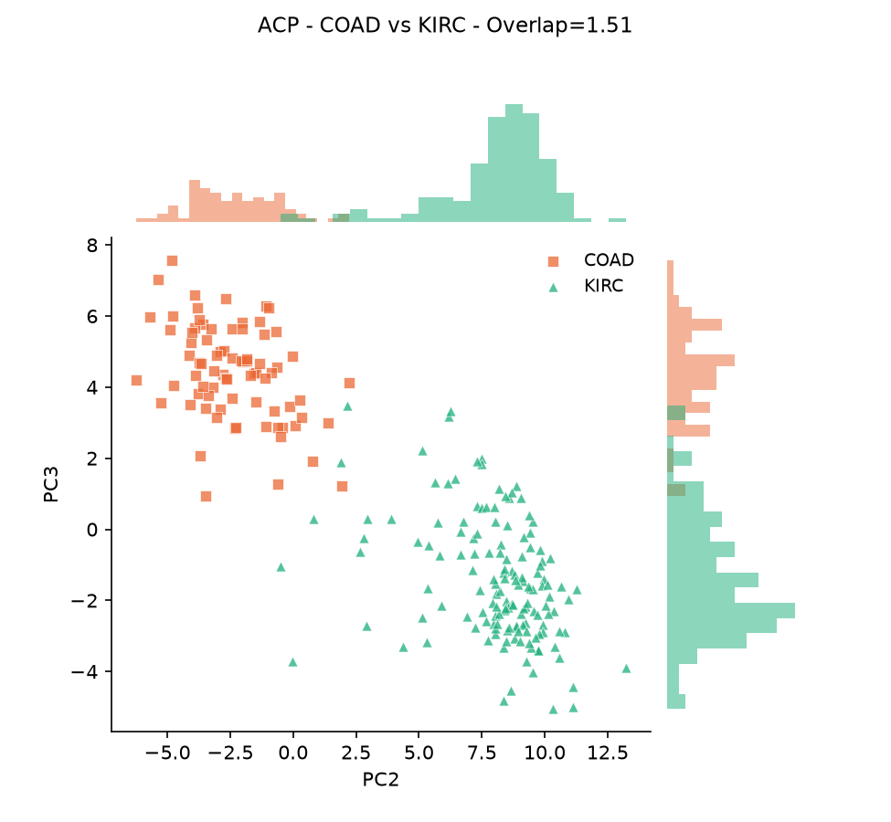
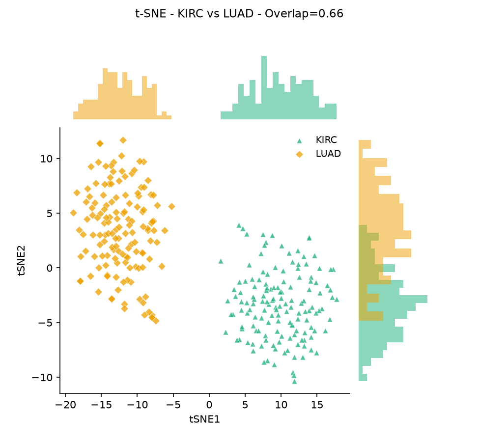

# TP1 — Compréhension et visualisation des données

**Cours** : IFT 599 / IFT 799 — Science de données
**Classe** : [IFT599-1 / IFT799-51 / IFT799-52 — à compléter]
**Équipe** :
- [Nom complet — CIP/matricule]
- [Nom complet — CIP/matricule]
- [Nom complet — CIP/matricule]

**Date** : [à compléter]

---

## 1. Introduction

Ce travail explore la séparabilité de cinq types de cancer (BRCA, KIRC, COAD, LUAD,
PRAD) à partir de profils d'expression génétique (jeu de données RNA-Seq PANCAN,
801 patients, 20531 gènes). Deux méthodes complémentaires sont mises en œuvre : une
analyse quantitative de séparabilité sans visualisation (Méthode 1), fondée sur une
mesure de chevauchement entre classes, et une analyse avec visualisation (Méthode 2),
fondée sur la sélection de paires de variables informatives et sur des techniques de
réduction de dimension (ACP, t-SNE).

## 2. Méthodologie

### 2.1 Préparation des données

Le jeu de données brut (801 patients × 20531 gènes) est trop volumineux pour calculer
une distance de Mahalanobis ou une ACP dans de bonnes conditions numériques. Une
réduction de dimension a donc été effectuée avant toute analyse, en trois étapes :

1. **Filtrage des gènes à variance nulle** : 267 gènes strictement constants sur les
   801 patients ont été retirés (20531 → 20264 gènes), car ils n'apportent aucune
   information et peuvent dégrader l'estimation de la covariance.
2. **Échantillonnage aléatoire** de 200 gènes parmi les 20264 restants (graine
   aléatoire fixe = 42, pour la reproductibilité), afin d'éviter tout biais qui
   proviendrait d'une sélection informée à l'avance.
3. **Standardisation** (centrage-réduction) de chaque gène, les niveaux d'expression
   génique variant considérablement en échelle d'un gène à l'autre.

La liste des 200 gènes retenus est fournie séparément (`data_cache/selected_genes.txt`),
conformément à la consigne de ne pas soumettre les données elles-mêmes.

Pour la distance de Mahalanobis, une **matrice de covariance globale** (calculée sur
les 801 patients, toutes classes confondues) a été utilisée plutôt qu'une covariance
propre à chaque classe. Ce choix est motivé par la taille de la plus petite classe
(COAD, 78 patients), insuffisante pour estimer de façon stable une covariance sur
200 variables ; à 801 échantillons pour 200 variables (ratio 4x), la covariance globale
reste numériquement bien conditionnée (nombre de conditionnement ≈ 625, aucune valeur
propre proche de zéro). Ce ratio reste toutefois modeste pour une estimation de
covariance robuste (un ratio ≥ 8x, obtenu par exemple avec 100 variables, offrirait une
estimation plus stable) — une limite à garder en tête dans l'interprétation des
résultats Mahalanobis.

*Remarque* : l'énoncé du TP mentionne 16382 variables dans le jeu de données initial,
alors que le fichier `data.csv` fourni en contient 20531. Cet écart n'affecte pas la
démarche (la réduction de dimension est faite indépendamment de ce nombre) mais est
signalé ici par souci de transparence.

### 2.2 Méthode 1 — Séparabilité sans visualisation

Pour chaque classe C, on définit la **distance intra-classe** comme la distance
maximale entre un patient de C et le centre de C (moyenne des patients de la classe) :

```
dist_intra(C) = max{ dist(xi, x̄_C) | xi ∈ C }
```

Pour deux classes C1 et C2, la **distance inter-classe** est le minimum entre la
distance minimale d'un point de C1 au centre de C2, et la distance minimale d'un point
de C2 au centre de C1 :

```
dist_inter(C1,C2) = min( dist(C1,C2), dist(C2,C1) )
```

L'indicateur de **chevauchement** combine les deux :

```
Overlap(C1,C2) = ( dist_intra(C1) + dist_intra(C2) ) / ( 2 × dist_inter(C1,C2) )
```

Overlap < 1 est une condition suffisante (mais non nécessaire) pour conclure que deux
classes sont bien séparées. Ces trois quantités ont été calculées pour les 10 paires
parmi les 5 classes, avec deux métriques de distance : **Euclidienne** (traite toutes
les variables de façon égale) et **Mahalanobis** (corrige pour les corrélations entre
gènes via la matrice de covariance globale).

### 2.3 Méthode 2 — Séparabilité avec visualisation

Trois approches ont été utilisées pour sélectionner des paires de variables à
visualiser, toutes évaluées avec la distance Euclidienne (par souci de simplicité,
comme suggéré dans l'énoncé) :

**a) Variables originales — sélection gloutonne (Sequential Forward Selection)**
Deux critères d'évaluation distincts ont été définis, tous deux fondés sur Overlap() :
- un critère **global** : la moyenne d'Overlap sur les 10 paires de classes, pour
  trouver la paire de variables séparant le mieux les 5 classes simultanément ;
- un critère **local** : Overlap d'une seule paire de classes, calculé uniquement sur
  les patients de ces 2 classes, répété pour chacune des 10 combinaisons.

L'algorithme procède en deux étapes : (1) parmi les 200 gènes, on garde celui qui
minimise seul le critère choisi ; (2) parmi les 199 gènes restants, on garde celui qui,
combiné au premier, minimise le mieux le critère en 2D. Le critère d'arrêt est
simplement l'obtention d'une paire (2 variables).

**b) Composantes principales (ACP)** : les 200 gènes sont transformés par ACP en
15 composantes principales, puis le même algorithme de sélection (SFS + Overlap) est
appliqué sur ces 15 nouvelles variables au lieu des gènes originaux.

**c) t-SNE** : contrairement à l'ACP, t-SNE produit directement un embedding en 2
dimensions — il n'y a donc pas de sélection de variables à faire. En revanche, comme
t-SNE optimise la préservation des voisinages locaux et non une distance globale, un
embedding est recalculé séparément pour chaque cas : une fois sur les 5 classes
ensemble (embedding « global »), et une fois pour chaque paire de classes prise
isolément (10 embeddings « locaux »).

Pour chaque paire de variables retenue, un nuage de points coloré par classe a été
produit, avec les histogrammes de distribution 1D de chaque variable affichés en marge
(inspiré de `seaborn.jointplot`), afin d'illustrer la séparation à la fois en 2D et
selon chaque axe pris séparément.

Implémentation : Python (numpy, pandas, scipy, scikit-learn, matplotlib). `PCA` et
`TSNE` proviennent de scikit-learn (voir Sources) ; toutes les fonctions de distance,
de sélection de variables et d'affichage ont été implémentées pour ce travail.

## 3. Résultats — Méthode 1

### Distance intra-classe

| Classe | Intra (Euclidienne) | Intra (Mahalanobis) |
|---|---|---|
| BRCA | 26.13 | 21.43 |
| COAD | 27.52 | 25.62 |
| KIRC | 28.19 | 20.45 |
| LUAD | 27.93 | 24.60 |
| PRAD | 32.74 | 26.09 |

### Matrice Overlap(C1, C2) — distance Euclidienne

| | BRCA | COAD | KIRC | LUAD | PRAD |
|---|---|---|---|---|---|
| **BRCA** | — | 2.337 | 2.104 | 2.581 | 2.655 |
| **COAD** | 2.337 | — | 2.062 | 2.744 | 2.351 |
| **KIRC** | 2.104 | 2.062 | — | 2.415 | 2.406 |
| **LUAD** | 2.581 | 2.744 | 2.415 | — | 2.857 |
| **PRAD** | 2.655 | 2.351 | 2.406 | 2.857 | — |

### Matrice Overlap(C1, C2) — distance de Mahalanobis

| | BRCA | COAD | KIRC | LUAD | PRAD |
|---|---|---|---|---|---|
| **BRCA** | — | 2.502 | 2.375 | 2.496 | 2.662 |
| **COAD** | 2.502 | — | 2.511 | 2.162 | 2.775 |
| **KIRC** | 2.375 | 2.511 | — | 2.500 | 2.597 |
| **LUAD** | 2.496 | 2.162 | 2.500 | — | 2.797 |
| **PRAD** | 2.662 | 2.775 | 2.597 | 2.797 | — |

**Constat** : avec les deux métriques, **toutes les paires de classes ont un Overlap
supérieur à 1** — aucune paire n'est « bien séparée » au sens strict du critère lorsque
les 200 gènes sont utilisés simultanément. Ce résultat, discuté en section 4, s'explique
par le fait que la grande majorité des 200 gènes choisis aléatoirement ne portent
vraisemblablement aucune information discriminante pour le type de cancer : ils
ajoutent du bruit à la distance intra-classe sans contribuer à séparer les centres des
classes.

## 4. Résultats — Méthode 2

### a) Variables originales

| Comparaison | Paire de gènes retenue | Overlap |
|---|---|---|
| Toutes les classes | gene_16680, gene_11393 | 16.716 |
| BRCA vs COAD | gene_4963, gene_6660 | 7.755 |
| BRCA vs KIRC | gene_11393, gene_16088 | 1.603 |
| BRCA vs LUAD | gene_8292, gene_11393 | 10.639 |
| BRCA vs PRAD | gene_13658, gene_753 | 2.067 |
| COAD vs KIRC | gene_11393, gene_9067 | **0.828** |
| COAD vs LUAD | gene_12722, gene_11393 | 2.011 |
| COAD vs PRAD | gene_15688, gene_18216 | **0.932** |
| KIRC vs LUAD | gene_14110, gene_18216 | 11.195 |
| KIRC vs PRAD | gene_18216, gene_13159 | 1.152 |
| LUAD vs PRAD | gene_15688, gene_13658 | 1.570 |

Deux paires de classes (COAD-KIRC, COAD-PRAD) atteignent un Overlap < 1 avec seulement
2 gènes bien choisis, confirmé visuellement par des nuages de points nettement séparés
(figure ci-dessous). D'autres paires restent très difficiles à séparer avec seulement
2 variables (KIRC vs LUAD, BRCA vs LUAD).





Ce dernier cas illustre une limite importante de la mesure Overlap() : `gene_14110`
présente une distribution très asymétrique (88.1% des patients partagent exactement la
même valeur basse, avec de rares valeurs extrêmes chez quelques patients). Comme
`dist_intra` est définie par un **maximum**, un seul patient extrême suffit à gonfler
fortement la distance intra-classe lorsqu'on ne travaille qu'en 1 ou 2 dimensions — la
figure montre effectivement une large colonne de points des deux classes superposés
autour de la valeur de référence.

### b) Composantes principales (ACP, 15 composantes)

Les 15 premières composantes principales expliquent 57.2% de la variance totale des
200 gènes (12.9% pour la seule première composante).

| Comparaison | Paire retenue | Overlap (ACP) | Overlap (brut) |
|---|---|---|---|
| Toutes les classes | PC6, PC3 | 16.274 | 16.716 |
| BRCA vs COAD | PC4, PC7 | 2.448 | 7.755 |
| BRCA vs KIRC | PC2, PC12 | 2.808 | 1.603 |
| BRCA vs LUAD | PC6, PC12 | 10.524 | 10.639 |
| BRCA vs PRAD | PC3, PC9 | 2.264 | 2.067 |
| COAD vs KIRC | PC2, PC3 | 1.510 | 0.828 |
| COAD vs LUAD | PC4, PC9 | 3.127 | 2.011 |
| COAD vs PRAD | PC3, PC7 | **0.801** | 0.932 |
| KIRC vs LUAD | PC2, PC11 | 3.916 | 11.195 |
| KIRC vs PRAD | PC2, PC12 | 1.515 | 1.152 |
| LUAD vs PRAD | PC3, PC2 | 1.252 | 1.570 |



**6 des 10 paires s'améliorent avec l'ACP, 4 se dégradent** — un résultat mitigé plutôt
qu'une amélioration systématique (discuté en section 5).

### c) t-SNE

| Comparaison | Overlap (t-SNE) | Overlap (ACP) | Overlap (brut) |
|---|---|---|---|
| Toutes les classes | **2.603** | 16.274 | 16.716 |
| BRCA vs COAD | 3.637 | 2.448 | 7.755 |
| BRCA vs KIRC | 4.551 | 2.808 | 1.603 |
| BRCA vs LUAD | 2.897 | 10.524 | 10.639 |
| BRCA vs PRAD | 1.474 | 2.264 | 2.067 |
| COAD vs KIRC | **0.327** | 1.510 | 0.828 |
| COAD vs LUAD | 2.408 | 3.127 | 2.011 |
| COAD vs PRAD | **0.277** | 0.801 | 0.932 |
| KIRC vs LUAD | **0.663** | 3.916 | 11.195 |
| KIRC vs PRAD | 1.769 | 1.515 | 1.152 |
| LUAD vs PRAD | 1.306 | 1.252 | 1.570 |



t-SNE obtient le meilleur résultat global (5 classes ensemble) et le plus grand nombre
de paires bien séparées (3 sur 10, contre 2 pour les variables brutes et 1 pour l'ACP).
Sur la figure ci-dessus, les histogrammes en marge montrent que la séparation KIRC/LUAD
est presque entièrement portée par l'axe tSNE1 (distributions quasi disjointes), alors
que tSNE2 seul se chevauche largement — la 2ᵉ dimension reste néanmoins nécessaire pour
consolider visuellement la séparation.

## 5. Analyse comparative

### Transformation vs non-transformation

Le tableau ci-dessous résume l'Overlap obtenu par les trois approches pour chaque
comparaison :

| Comparaison | Brut | ACP | t-SNE |
|---|---|---|---|
| Toutes les classes | 16.716 | 16.274 | **2.603** |
| BRCA vs COAD | 7.755 | **2.448** | 3.637 |
| BRCA vs KIRC | **1.603** | 2.808 | 4.551 |
| BRCA vs LUAD | 10.639 | 10.524 | **2.897** |
| BRCA vs PRAD | 2.067 | 2.264 | **1.474** |
| COAD vs KIRC | **0.828** | 1.510 | 0.327 |
| COAD vs LUAD | **2.011** | 3.127 | 2.408 |
| COAD vs PRAD | 0.932 | 0.801 | **0.277** |
| KIRC vs LUAD | 11.195 | 3.916 | **0.663** |
| KIRC vs PRAD | **1.152** | 1.515 | 1.769 |
| LUAD vs PRAD | 1.570 | 1.252 | **1.306** |
| Nb paires < 1 | 2/10 | 1/10 | **3/10** |

**Aucune des trois approches ne domine sur toutes les paires de classes** : t-SNE
l'emporte nettement en moyenne et sur la séparation globale des 5 classes, mais
BRCA vs KIRC est mieux séparée avec seulement 2 gènes bruts (1.603) qu'avec t-SNE
(4.551). Ce résultat illustre que le choix de la meilleure représentation dépend de la
paire de classes considérée, pas uniquement de la méthode.

### Euclidienne vs Mahalanobis (Méthode 1)

Les deux métriques mènent à la même conclusion qualitative (aucune paire bien séparée
avec 200 gènes bruts) et **s'accordent sur la paire la moins bien séparée** : LUAD vs
PRAD obtient le plus grand Overlap avec les deux métriques (2.857 en Euclidienne, 2.797
en Mahalanobis). En revanche, elles **ne s'accordent pas sur la paire la mieux
séparée** : COAD vs KIRC arrive en tête avec la distance Euclidienne (2.062), tandis
que COAD vs LUAD arrive en tête avec Mahalanobis (2.162) — cette dernière paire est au
contraire l'une des plus mauvaises en Euclidienne (2.744, 9ᵉ sur 10). Ce désaccord sur
le classement, malgré une conclusion d'ensemble identique, illustre concrètement l'effet
de la prise en compte des corrélations entre gènes par Mahalanobis, absente de la
distance Euclidienne.

### ACP vs t-SNE

t-SNE surpasse l'ACP dans la majorité des cas, en particulier pour l'embedding global
(2.603 contre 16.274) et pour la paire auparavant la plus difficile (KIRC vs LUAD :
3.916 en ACP contre 0.663 en t-SNE). Deux différences structurelles expliquent cet
écart :
1. t-SNE exploite les 200 gènes de façon **non linéaire**, alors que l'ACP se limite à
   des combinaisons **linéaires** des variables ;
2. t-SNE optimise directement la préservation des voisinages locaux (proche de la
   notion de séparation de classes), alors que l'ACP optimise uniquement la variance
   totale, sans lien direct avec la séparabilité.

Ce deuxième point explique aussi pourquoi l'ACP donne des résultats mitigés (section
4b) : l'ACP est une méthode **non supervisée** qui ignore les labels de classe ; rien ne
garantit qu'une direction de forte variance corresponde à une direction qui sépare les
classes. Une hypothèse initiale, selon laquelle une composante principale serait dominée
par un gène à distribution extrême (`gene_14110`), a été testée en examinant les
coefficients (loadings) de l'ACP et **infirmée** : ce gène a un poids faible sur toutes
les composantes (maximum 0.088, contre 0.15–0.22 pour les gènes qui dominent réellement
les premières composantes). L'explication retenue est plutôt que l'ACP mélange des
gènes discriminants avec d'autres gènes non discriminants mais à forte variance,
diluant ainsi un signal qui était net dans l'espace original pour certaines paires de
classes (ex. COAD vs KIRC, dégradée de 0.828 à 1.510).

Il convient également de noter que les distances dans un embedding t-SNE ne sont pas
directement comparables à des distances euclidiennes classiques : t-SNE préserve des
relations de voisinage, pas des distances globales. Les valeurs d'Overlap calculées sur
un embedding t-SNE doivent donc être interprétées comme indicatives plutôt que comme
une mesure rigoureusement comparable à celle obtenue sur les variables brutes ou l'ACP.

### Limite générale de la mesure Overlap()

Au-delà de la comparaison des méthodes, ce travail met en évidence une limite propre à
la définition même d'Overlap() : parce que `dist_intra` utilise un **maximum** et
`dist_inter` un **minimum**, la mesure reste sensible à un petit nombre de points
extrêmes, quel que soit l'espace de représentation (variables brutes, ACP, ou même
t-SNE). Ceci a été observé concrètement à la fois sur des gènes bruts à distribution
asymétrique (section 4a) et sur un embedding ACP par ailleurs visuellement bien séparé
(un unique patient KIRC atypique suffisant à dégrader l'Overlap de la paire COAD vs
KIRC). Cette sensibilité aux valeurs extrêmes est cohérente avec la mise en garde de
l'énoncé selon laquelle la condition Overlap < 1 est suffisante mais non nécessaire
pour conclure à une bonne séparation.

## 6. Conclusion

La Méthode 1, appliquée à 200 gènes choisis aléatoirement, ne permet de conclure à une
bonne séparation pour aucune paire de classes, que ce soit avec la distance Euclidienne
ou de Mahalanobis — un résultat cohérent avec le fait que la plupart des gènes pris au
hasard ne sont pas discriminants pour le type de cancer. La Méthode 2 montre en
revanche qu'une sélection ciblée de variables (ou une transformation adaptée) peut
révéler une séparation nette pour plusieurs paires de classes, avec des résultats très
variables selon la méthode et la paire considérée : les variables originales bien
sélectionnées et t-SNE obtiennent chacune le meilleur résultat sur certaines
comparaisons, tandis que l'ACP, méthode non supervisée et linéaire, offre les
résultats les plus mitigés. Aucune méthode ne s'impose universellement, ce qui
souligne l'intérêt de combiner plusieurs approches complémentaires lors d'une étude
exploratoire de données à haute dimension.

## 7. Sources

- Jeu de données : UCI Machine Learning Repository, *gene expression cancer RNA-Seq
  Data Set (PANCAN)*, https://archive.ics.uci.edu/dataset/401/gene+expression+cancer+rna+seq
- Pedregosa, F. et al., *scikit-learn: Machine Learning in Python*, JMLR 12, 2011 —
  implémentations utilisées : `sklearn.decomposition.PCA`,
  `sklearn.manifold.TSNE` (https://scikit-learn.org)
- Waskom, M., *seaborn: statistical data visualization* — inspiration pour la mise en
  page des nuages de points avec histogrammes marginaux
  (https://seaborn.pydata.org/generated/seaborn.jointplot.html)

## Annexe

- Liste complète des 200 gènes sélectionnés : `data_cache/selected_genes.txt`
- Tableaux détaillés de la Méthode 1 (intra-classe, inter-classe, Overlap, pour les
  deux métriques) : `figures/method1/*.csv`
- Ensemble des figures (nuages de points, toutes paires de classes, 3 méthodes) :
  répertoire `figures/`
- Code source complet : répertoire `src/`
